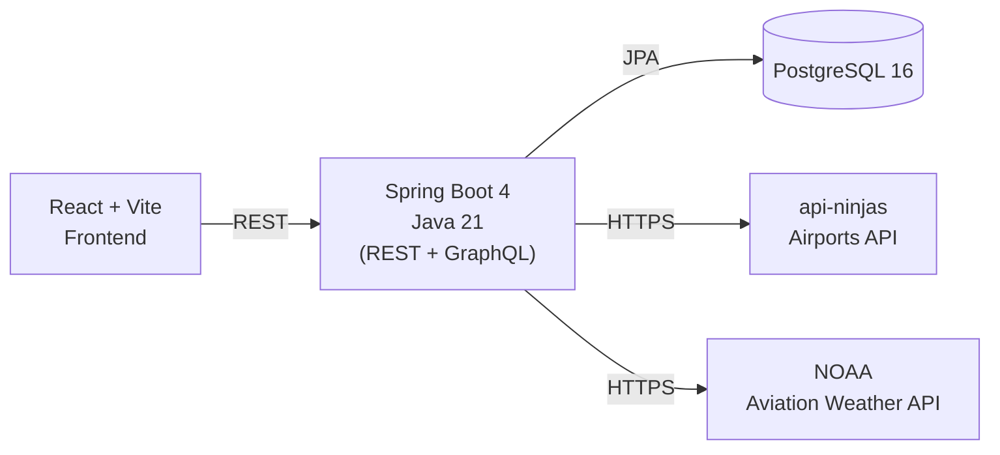
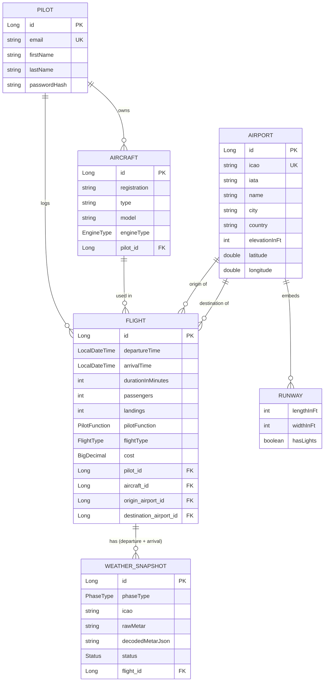
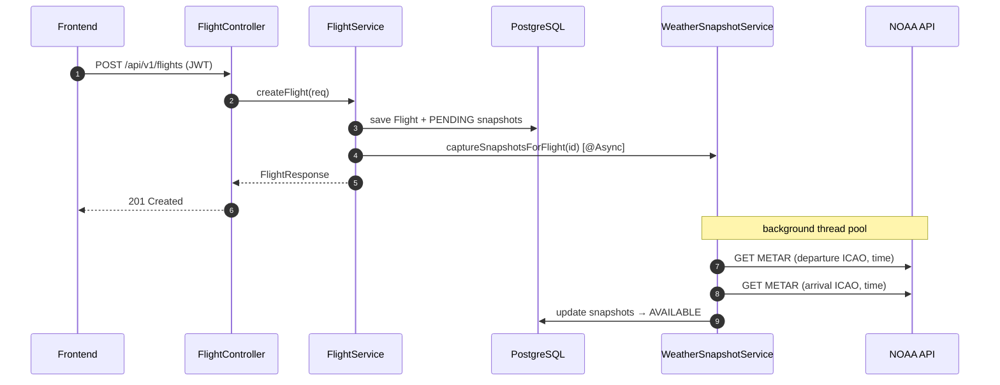

# PilotLogbook
*Christoph Gahabka, Airbus Defence and Space, Munich*

A small web app for private pilots to log their flights and see airport and weather data for each flight.

## Project description

PilotLogbook lets a pilot keep a personal flight log. After registering, the pilot adds their aircraft and then logs 
flights between two airports (entered as ICAO code, for example `EDDM` for Munich). For every flight the backend looks 
up the airport data (name, coordinates, runways, elevation) and a METAR weather observation for both the departure and 
the arrival airport at the time of the flight. The dashboard shows all flights with filters on a map and has a section
where the pilot can fetch the current weather for any airport. The detailed keeps all information about the flight, 
the aircraft, the airports and the weather.

This is a project for the *Web Engineering* course at DHBW Ravensburg (summer 2026).

## Features

- Pilot accounts with register and login (JWT authentication, stateless)
- Full CRUD for flights and aircraft (scoped to the logged-in pilot)
- Airport lookup by ICAO code with local caching and automatic retry
- Weather snapshots (METAR) for departure and arrival, captured asynchronously in the background per flight 
- Live and historical METAR (closest observation to a given UTC timestamp)
- Dashboard with filters (origin, destination, flight duration, month)
- interactive flight route map on the dashboard and flight detail page (React Leaflet)
- Form validation on both sides: Bean Validation on the backend, Zod + React Hook Form on the frontend
- REST API and GraphQL API, OpenAPI/Swagger UI and a GraphiQL playground
- Central error handling that returns RFC 7807 ProblemDetail responses
- Starts with one command via Docker Compose, with CI running on every push

## Architecture



The backend uses the following structure: `Controller -> Service -> Repository`. Things like security, caching, retries 
and error handling are in their own packages (`security`, `config`, `exception`).

### Data model



### Authentication and security

Login is done with Spring Security and JWT (stateless):

- Register and login at `POST /api/v1/auth/register` and `POST /api/v1/auth/login`. Both return a JWT (Bearer token). 
Passwords are hashed with **BCrypt** before saving.
- The JWT is signed with HS256 using the `jjwt` library. It expires after 24 hours. And the secret comes from the 
`JWT_SECRET` env variable (base64, at least 32 bytes). Code is in `security/JwtService.java`.
- `JwtAuthFilter` runs before the standard `UsernamePasswordAuthenticationFilter`. It reads the Bearer token, checks it, 
and loads the `Pilot` as the Spring Security principal.
- Every query for `Flight` and `Aircraft` is filtered by the current pilot ID, so one pilot can never see or change 
another pilot's data.
- Session policy is `STATELESS`, so no session cookies and no CSRF token are needed.
- CORS only allows `http://localhost:*` and `http://127.0.0.1:*` (for local development).
- Public endpoints (no JWT needed): `/api/v1/auth/**`, `/api/v1/airports/{icao}`, `/api/v1/metars`, `/api/v1/graphql`, 
`/graphiql/**`, `/swagger-ui/**`, `/v3/api-docs/**`, `/actuator/health`. Every other endpoint requires a valid JWT.

### Resilience

Both external APIs can be slow or temporarily down, so the backend protects itself with the following:

| Topic    | Implementation | Config                                                                                                |
|----------|------------------------------------|-------------------------------------------------------------------------------------------------------|
| Caching  | Spring Cache + Caffeine            | `airports`: 24 h TTL, 2000 entries; `liveMetar`: 10 min TTL, 500 entries (see `config/CacheConfig.java`) |
| Retries  | Spring Retry `@Retryable` on `AirportService.fetchFromNinja()` | 3 attempts, exponential backoff 500 ms -> 5s (multiplier 2)                                           |
| Timeouts | Connect and read timeout on each `RestClient` | airport API: 5s, weather API: 20s                                                                     |
| Async    | `@Async` on the weather snapshot, so creating a flight returns right away | thread pool with 2 to 4 workers (`spring.task.execution.pool`)                                        |
| Health   | Spring Boot Actuator + Docker `pg_isready` healthcheck | `/actuator/health`, Compose waits for Postgres to be healthy                                          |

=> When saving a flight, a weather snapshot is saved for the departure and arrival airport. If the weather API is down 
for a moment or not reachable, the flight is still saved. The weather snapshots just stay in `PENDING` and can be
refreshed later. Repeated lookups for the same ICAO come from the cache, and failed calls to api-ninjas are retried automatically.

Flight creation step by step:



## Tech stack

| Layer | Technologies |
|---|---|
| Backend | Java 21, Spring Boot 4, Spring Data JPA, Spring Security + JWT (jjwt), Spring GraphQL, Spring Retry, <br/>Spring Cache + Caffeine, Spring Boot Actuator, springdoc-openapi, Bean Validation, Lombok |
| Frontend | React 19, TypeScript, Vite, React Router, React Hook Form + Zod, Axios, Tailwind CSS 4, React Leaflet |
| Database | PostgreSQL 16 (dev and prod), H2 (tests) |
| Build / Infra | Maven, Docker, Docker Compose, GitHub Actions |

## Getting started

### Prerequisites

- Java 21
- Node 20
- Maven 3.9+ (or use the included `./mvnw`)
- Docker (needed for the quick-start path below)
- PostgreSQL 16 (only if you want to start the backend without Docker)

### Environment variables

Copy `.env.example` to `.env` in the project root and fill in:

| Variable | Purpose |
|---|---|
| `DB_USERNAME`, `DB_PASSWORD` | Postgres credentials (defaults: `pilot` / `pilot_password`) |
| `JWT_SECRET` | Base64, at least 32 bytes. Generate with `openssl rand -base64 32` |
| `AIRPORT_API_KEY` | Free key from [api-ninjas.com](https://api.api-ninjas.com/profile). |

### Quick start with Docker Compose

```bash
cp .env.example .env       # then fill in JWT_SECRET and AIRPORT_API_KEY
docker compose up --build
```

This starts all three services (Postgres, backend, frontend). Once the containers are up:

- Frontend: <http://localhost:4173>
- Backend:  <http://localhost:8080>
- Swagger:  <http://localhost:8080/swagger-ui.html>

### Manual start (without Docker)

Start a local Postgres with a database called `pilotlogbook` (or just the Postgres service from compose: `docker compose 
up postgres`). Then in two terminals:

```bash
# Terminal 1 - backend (port 8080)
./mvnw spring-boot:run

# Terminal 2 - frontend (port 5173)
cd frontend
npm ci
npm run dev
```

For the manual frontend start also create `frontend/.env` with `VITE_API_URL=http://localhost:8080` so Axios knows 
where the backend is.

## Third-party APIs

| API | Purpose | Auth | Used by |
|---|---|---|---|
| [api-ninjas Airports](https://api-ninjas.com/api/airports) | Airport data by ICAO / IATA: name, city, country, coordinates, elevation, runways | API key (`AIRPORT_API_KEY`) | `AirportService.fetchFromNinja()`, cached with Caffeine and retried with backoff |
| [NOAA Aviation Weather](https://aviationweather.gov/data/api/) | METAR observations (raw and decoded), live and historical | none | `WeatherService.getLiveMetar()` / `getHistoricalMetar()`, fetched in the background for each flight |

## API documentation

When the backend is running:

- Swagger UI: <http://localhost:8080/swagger-ui.html>
- OpenAPI JSON: <http://localhost:8080/v3/api-docs>
- GraphiQL playground: <http://localhost:8080/graphiql>

## Testing

```bash
./mvnw test
```

There are **11 test classes with 13 test methods** in total. 
They cover four different areas:

| Type | Spring slice | Classes | Covers |
|---|---|---|---|
| Unit (Mockito, no Spring context) | none | `JwtServiceTest`, `AirportServiceTest`*, `AuthServiceTest`, `FlightServiceTest`, `WeatherSnapshotServiceTest` | JWT generation and parsing, service-layer logic, mapping of external API responses |
| Repository / persistence | `@DataJpaTest` (H2 in memory) | `PilotRepositoryTest`, `AircraftRepositoryTest`, `FlightRepositoryTest` | JPA mappings, unique constraints, custom finder queries |
| API / integration | `@SpringBootTest` + `@AutoConfigureMockMvc` | `AuthControllerApiTest`, `SecurityApiTest` | full HTTP flow including the JWT filter chain and Spring Security rules |
| Application smoke | `@SpringBootTest` | `PilotLogbookApplicationTests` | the Spring context starts and all beans are wired |

\* `AirportServiceTest` uses `@ParameterizedTest` with `@ValueSource` to check ICAO input against four invalid formats.

Tests use an in-memory H2 database, so no Postgres, no API keys and no internet are needed to run them. The same command also runs in CI.

## CI

GitHub Actions (`.github/workflows/ci.yml`) runs on push and pull request to `main` and `dev`. Two jobs run in parallel:

- **Backend**: `./mvnw -B verify` on JDK 21
- **Frontend**: `npm ci`, `npm run lint`, `npm run build` on Node 20

## Project structure

```
.
├── src/
│   ├── main/java/de/dhbwravensburg/webeng/pilotlogbook/
│   │   ├── controller/   REST endpoints (Auth, Aircraft, Flight, Airport, Weather, Health)
│   │   ├── service/      business logic, external API calls, async weather snapshots
│   │   ├── repository/   Spring Data JPA repositories
│   │   ├── model/        JPA entities (Pilot, Aircraft, Flight, Airport, WeatherSnapshot, Runway)
│   │   ├── dto/          request and response DTOs (`dto/external` for upstream API payloads)
│   │   ├── graphql/      GraphQL controllers
│   │   ├── security/     SecurityConfig, JwtAuthFilter, JwtService
│   │   ├── config/       Caffeine cache, GraphQl, RestClient beans for upstream APIs
│   │   ├── exception/    GlobalExceptionHandler (RFC 7807 ProblemDetail)
│   │   └── util/         helper classes (Providing Aircraft, Flight and Pilot)
│   ├── main/resources/   application.properties, GraphQL schema
│   └── test/java/        11 test classes (unit, repository, API, smoke)
├── frontend/
│   └── src/
│       ├── pages/        LandingPage, EmailPage, LoginPage, RegisterPage, DashboardPage, DetailedPage
│       ├── components/   shared UI plus grouped folders (auth, dashboard, detailed, flight-form, ui)
│       ├── api/          Axios clients (auth, flights, aircraft, airports, weather) and JWT interceptor
│       ├── schemas/      Zod schemas for every form (login, register, new/edit flight, add aircraft)
│       ├── routes/       AppRouter, ProtectedRoute
│       ├── context/      AuthContext and useAuth hook
│       ├── hooks/        custom hooks (e.g. useClickOutside)
│       ├── types/        TypeScript types that mirror the backend DTOs
│       ├── utils/        token storage, API error mapping, formatters
│       └── constants/
├── docker-compose.yml    Postgres + backend + frontend
├── Dockerfile            multi-stage build for the backend
├── pom.xml
└── .github/workflows/ci.yml
```

## License

[MIT](LICENSE) © Christoph Gahabka
